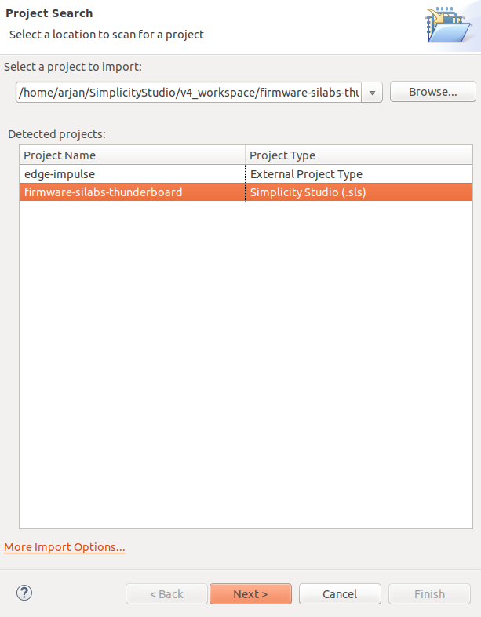
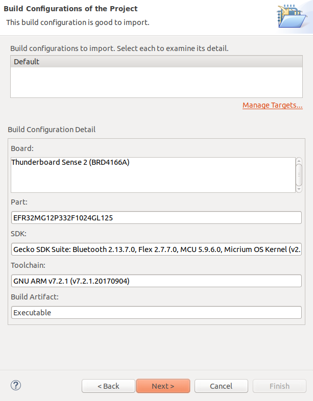
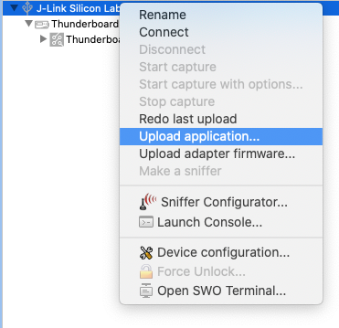
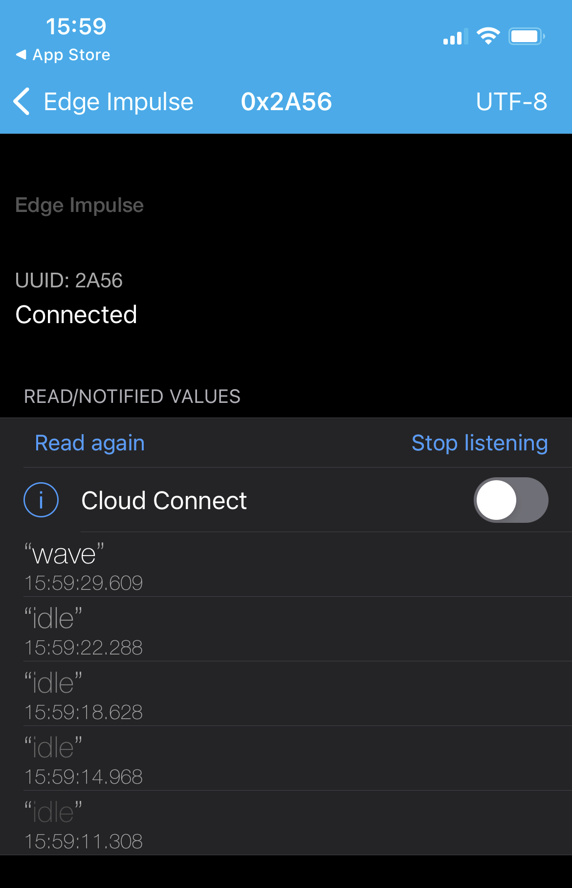

# Edge Impulse firmware for SiLabs Thunderboard Sense 2

[Edge Impulse](https://www.edgeimpulse.com) enables developers to create the next generation of intelligent device solutions with embedded Machine Learning. This repository contains the Edge Impulse firmware for the Silicon Labs Thunderboard Sense 2 development board. This device supports all Edge Impulse device features, including ingestion, remote management and inferencing.

> **Note:** Do you just want to use this development board with Edge Impulse? No need to build this firmware. See the instructions [here](https://docs.edgeimpulse.com/docs/silabs-thunderboard-sense-2) for a prebuilt image and instructions. Or, you can use the [data forwarder](https://docs.edgeimpulse.com/docs/cli-data-forwarder) to capture data from any sensor.

## Requirements

### Hardware

* [SiLabs Thunderboard Sense 2](https://www.silabs.com/development-tools/thunderboard/thunderboard-sense-two-kit) development board.

### Tools

* [Simplicity Studio 4](https://www.silabs.com/developers/simplicity-studio).

Alternatively you can build this application with Docker (see below).

## Building the application (locally)

### Importing the firmware in Simplicity Studio

1. Clone this repository:

    ```
    $ git clone https://github.com/edgeimpulse/firmware-silabs-thunderboard-sense-2
    ```

1. Open Simplicity Studio v4, and start the import wizard via **Project > Import > MCU Project...**.

1. Navigate to the `firmware-silabs-thunderboard-sense-2` directory. Select the **firmware-silabs-thunderboard-sense-2** project and choose **Next**.

    

1. On the next page, select the `GNU ARM v7.2.1` toolchain (if it's not selected already).

    

1. Click **Finish** again to import the project.

### Building and flashing the firmware

1. In Simplicity Studio v4, select **Project > Build Project** to build the firmware.
1. Then, right click on the development board in the *Debug adapters* section of Simplicity Studio and select **Upload application**.

    

1. Under *Application image path* select the `GNU ARM v7.2.1 - Default/firmware-silabs-thunderboard-sense-2.bin` file and click **OK** to flash.

## Building this project from the command line (locally)

You'll need to have Simplicity Studio 4 installed and configured. Then you can run:

**macOS**

```
$ mkdir -p ~/ei-workspace
$ ./build.sh --build /Applications/Simplicity\ Studio.app/Contents/Eclipse/ ~/ei-workspace
```

**Linux**

```
$ mkdir -p ~/ei-workspace
$ ./build.sh --build /opt/SimplicityStudio_v4 .
```

Replace `/opt/SimplicityStudio_v4` to the path your Simplicity Studio installation.

### Flashing the firmware

You can either drag `./GNU ARM v7.2.1 - Default/firmware-silabs-thunderboard-sense-2.bin` to the `TB004` mass-storage device (mounts as a USB flash drive), or flash with the JLink tools via:

```
$ ./build.sh --flash
```

## Building the application (Docker)

1. Clone this repository:

    ```
    $ git clone https://github.com/edgeimpulse/firmware-silabs-thunderboard-sense-2
    ```

1. Build the container:

    ```
    $ docker build -t ei-thunderboard-sense2 .
    ```

1. Build the application:

    ```
    $ docker run --rm -v ei-tbsense-workspace:/workspace -v $PWD:/app ei-thunderboard-sense2 /bin/bash build.sh --build /opt/SimplicityStudio_v4 /workspace
    ```

1. Copy the `GNU ARM v7.2.1 - Default/app.bin` file to the `TB004` mass-storage device (mounts like a USB flash drive) to flash the firmware.

## Streaming results over BLE to your phone

Want to stream the results of your impulse over BLE to your phone? No problem! To do so:

1. Set the `USE_BLE_CLASSIFICATION=1` macro (defined in [ei_device_silabs_efm32mg.h](edgeimpulse/ingestion-sdk-platform/SiliconLabs/ei_device_silabs_efm32mg.h)).
1. Rebuild and flash this application.
1. Open a BLE scanner on your phone (tested with LightBlue on iOS) and :
    * Connect to the **Edge Impulse** device.
    * Subscribe to the `2A56` characteristic.
    * Decode the message as UTF8 (click on `HEX` in the top right corner in LightBlue to switch).
1. Start classification via a serial terminal:

    ```
    $ edge-impulse-run-impulse
    ```
   
   Or on your phone by writing a `1` HEX value to the `0x2A58` resource on the device.
1. You now see the classification results on your phone!

    
