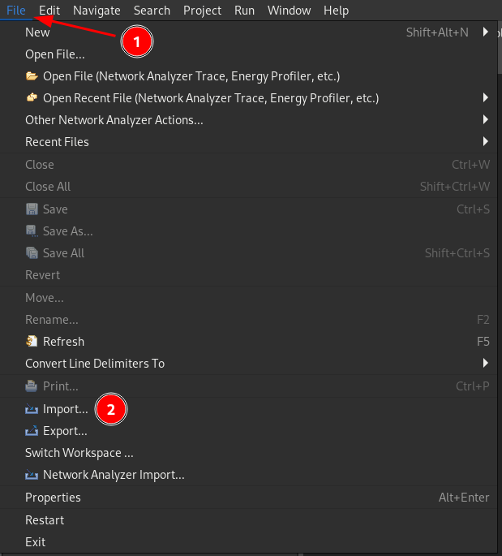
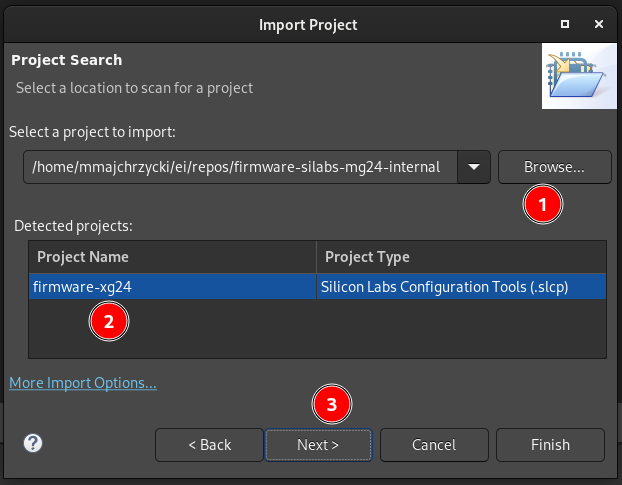
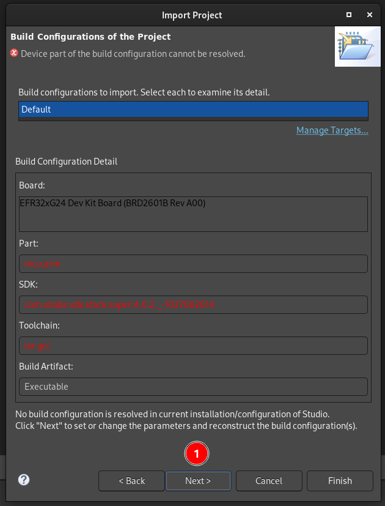
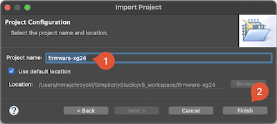
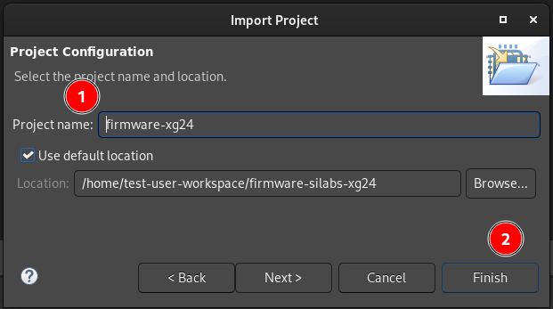
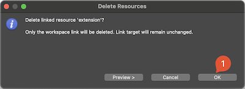
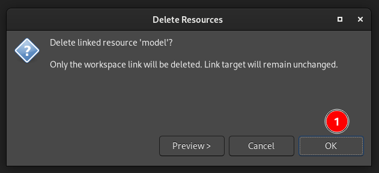
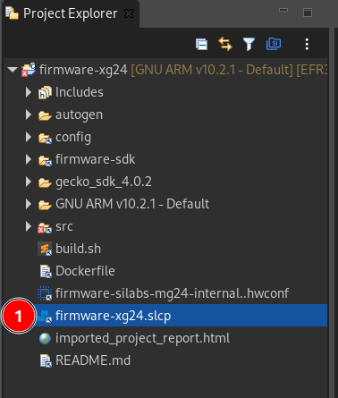
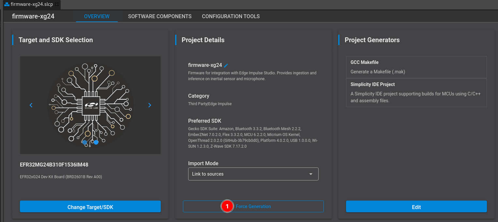
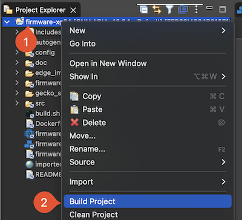

# Edge Impulse firmware for SiLabs Thunderboard Sense 2

[Edge Impulse](https://www.edgeimpulse.com) enables developers to create the next generation of intelligent device solutions with embedded Machine Learning. This repository contains the Edge Impulse firmware for the Silicon Labs Thunderboard Sense 2 development board. This device supports all Edge Impulse device features, including ingestion, remote management and inferencing.

> **Note:** Do you just want to use this development board with Edge Impulse? No need to build this firmware. See the instructions [here](https://docs.edgeimpulse.com/docs/development-platforms/officially-supported-mcu-targets/silabs-thunderboard-sense-2) for a prebuilt image and instructions. Or, you can use the [data forwarder](https://docs.edgeimpulse.com/docs/cli-data-forwarder) to capture data from any sensor.

This firmware has a [BLE capabilities](https://docs.edgeimpulse.com/docs/development-platforms/officially-supported-mcu-targets/silabs-thunderboard-sense-2#bluetooth-demo) built-in that allow you to start/stop inference and see its results on the mobile phone.

## Source code organization

* If you want to deploy your model (exported as a `Simplicity Studio Component` from Studio), extract the exported `zip` file content into:

    `ei-model`

### Reporting issues

This repository is a snapshot of the Edge Impulse internal code base, therefore PRs won't be merged. If you find any bugs or want to contribute use our [Developer Forum](https://forum.edgeimpulse.com/) to submit them.

## Requirements

### Hardware

* SiLabs Thunderboard Sense 2 development board ([documentation](https://www.silabs.com/documents/public/user-guides/ug309-sltb004a-user-guide.pdf))
> :warning: This board is **Not recommended for new designs**. For a replacement, see the [EFR32xG24 Dev Kit](https://www.silabs.com/development-tools/wireless/efr32xg24-dev-kit) :warning:

### Software

For a local build using command line tools:
* [SLC CLI Tools](https://www.silabs.com/documents/public/user-guides/ug520-software-project-generation-configuration-with-slc-cli.pdf)
* [GNU Arm Embedded Toolchain 10-2020-q4-major](https://developer.arm.com/tools-and-software/open-source-software/developer-tools/gnu-toolchain/gnu-rm/downloads)
* [Gecko SDK v4.0.2](https://github.com/SiliconLabs/gecko_sdk/tree/v4.0.2)

For build using Docker container:
* [Docker Desktop](https://www.docker.com/products/docker-desktop)

For build using Simplicity Studio v5:
* [Simplicity Studio 5](https://www.silabs.com/developers/simplicity-studio) with Gecko SDK 4.0.2

## How to build

### Local build using command line tools

1. Clone the [Gecko SDK v.4.0.2](https://github.com/edgeimpulse/gecko_sdk.git)

    ```
    git clone -b ei-gsdk_4.0 https://github.com/edgeimpulse/gecko_sdk.git
    ```

1. Install [SLC CLI Tools (see p. 2.1)](https://www.silabs.com/documents/public/user-guides/ug520-software-project-generation-configuration-with-slc-cli.pdf)
1. Configure `SLC CLI` to point the location of the `Gecko SDK` and sign the SDK

    ```
    slc configuration --sdk /home/user/gecko_sdk/
    slc signature trust --sdk /home/user/gecko_sdk/
    ```

1. Also configure the default location of your toolchain, eg.

    ```
    slc configuration --gcc-toolchain /opt/toolchains/gcc-arm-none-eabi-10-2020-q4-major
    ```

1. Clone this repository and build

    ```
    git clone git@github.com:edgeimpulse/firmware-silabs-thunderboard-sense-2.git
    cd firmware-silabs-thunderboard-sense-2/
    ./build.sh --build
    ```

### Using Docker

1. Clone this repository

    ```
    git clone git@github.com:edgeimpulse/firmware-silabs-thunderboard-sense-2.git
    cd firmware-silabs-thunderboard-sense-2/
    ```

1. Build the container

    ```
    $ docker build -t edge-impulse-silabs-thunderboard-sense-2 .
    ```

1. Build the application

    ```
    docker run --rm -v $PWD:/app edge-impulse-silabs-thunderboard-sense-2 /bin/bash build.sh --build
    ```

### Using Simplicity Studio v5

1. Install [Simplicity Studio v5](https://www.silabs.com/developers/simplicity-studio) and [Gecko SDK v4.0.2](https://github.com/SiliconLabs/gecko_sdk)
1. Clone this repository
1. In the Simplicity Studio, choose `File -> Import`

    

1. Browse to the directory with cloned repository and select `firmware-silabs-thunderboard-sense-2` project

    

1. On the next step, you will see error that the device part of the build configuration cannot be resolved, ingore it and go to next step

    

1. In the `Boards` section, select (type in) `BRD4166A` and make sure to select Gecko SDK 4.0.2

    

1. Choose a project name in your workspace and finish

    

1. We have to make a small tweak. In the `Project Explorer` panel, right click on the `ei-model` directory and choose `Delete`

    

1. Confirm that only workspace link will be removed, the target will remain unchanged

    

1. Now, double click on the `firmware-thunderboard-sense-2.slcp` file to open project configuration

    

1. In the new window click `Force Regeneration`

    

1. Build the project

    


## How to flash the board

You can either drag `./build/debug/firmware-silabs-thunderboard-sense-2.bin` to the `TB004` mass-storage device (mounts as a USB flash drive), or flash with the [Simplicity Commander](https://community.silabs.com/s/article/simplicity-commander?language=en_US) tool via:

```
$ ./build.sh --flash
```
